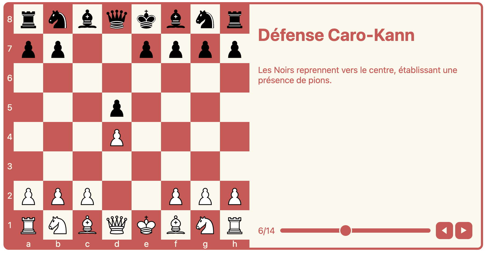
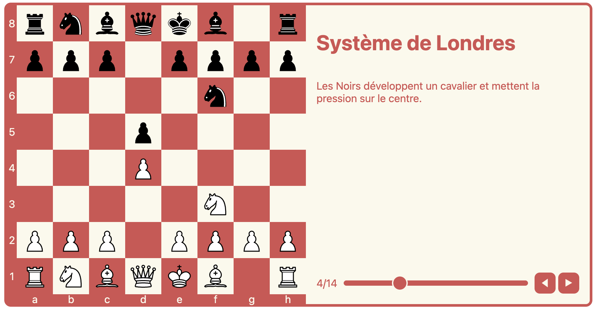

# Interactive Chess Opening Viewer

An interactive React component for visualizing and learning chess openings. This project allows users to step through chess openings move by move, with descriptions and explanations.

## Features

- Interactive chess board visualization
- Step-by-step move playback
- Opening descriptions and explanations
- Support for complex moves (like castling)
- Move slider for quick navigation

## Screenshots

### Caro-Kann Defense

Black recaptures towards the center, establishing a pawn presence.

### London System

Black develops a knight and puts pressure on the center.

## Usage

```tsx
import ChessBoard, { ChessMove } from './components/ChessBoard';

// Example of a simple move
const singleMove: ChessMove = {
  from: 'e2',
  to: 'e4',
  piece: 'p',
  color: 'w',
  description: "King's Pawn Opening"
};

// Example of castling (multiple piece move)
const castlingMove: ChessMove[] = [
  {
    from: 'e1',
    to: 'g1',
    piece: 'k',
    color: 'w',
    description: 'Kingside Castling'
  },
  {
    from: 'h1',
    to: 'f1',
    piece: 'r',
    color: 'w'
  }
];

// Using the component
function App() {
  return (
    <ChessBoard 
      moves={[singleMove, castlingMove]} 
      title="Opening Example"
    />
  );
}
```

## Component Props

| Prop | Type | Description |
|------|------|-------------|
| moves | `(ChessMove \| ChessMove[])[]` | Array of moves or move groups |
| initialPosition | `string[][]?` | Optional custom initial board position |
| title | `string?` | Title displayed above the board |
| description | `string?` | Additional description text |

## ChessMove Interface

```typescript
interface ChessMove {
  from: string;      // Starting square (e.g., 'e2')
  to: string;        // Target square (e.g., 'e4')
  piece: string;     // Piece type (e.g., 'p', 'r', 'n', 'b', 'q', 'k')
  color: 'w' | 'b';  // Piece color ('w' for white, 'b' for black)
  description?: string; // Optional move description
}
```

## Installation

1. Clone the repository:
```bash
git clone https://github.com/yourusername/chess.git
```

2. Install dependencies:
```bash
cd chess
npm install
```

3. Start the development server:
```bash
npm start
```

## Contributing

Contributions are welcome! Please feel free to submit a Pull Request.

## License

This project is licensed under the MIT License - see the LICENSE file for details.
